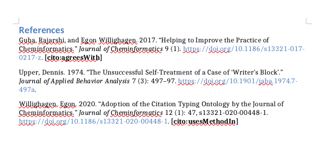

---
title: "A sample Research article title"
author:
- Jane E. Doe [1,*,orcid:0000-0002-0778-8115]
- John R.S. Smith [1,2,orcid:0000-0001-0002-0003]
link-citations: yes
output:
  html_document:
    pandoc_args:
    - --lua-filter=filters/extract-cito.lua
    - --citeproc
    - --lua-filter=filters/insert-cito-in-ref.lua
  pdf_document:
    pandoc_args:
    - --lua-filter=filters/extract-cito.lua
    - --citeproc
    - --lua-filter=filters/insert-cito-in-ref.lua
  word_document:
    pandoc_args:
    - --lua-filter=filters/extract-cito.lua
    - --citeproc
    - --lua-filter=filters/insert-cito-in-ref.lua
# RStudio: cito-bibliography: bibliography.bib
# Other: bibliography: bibliography.bib
cito-bibliography: bibliography.bib
csl: journal-of-cheminformatics.csl
...

* Correspondance:
jane.e.doe@unifraneker.nl

# Abstract

**Background:** Text for this section. Research articles should include an abstract
that does not exceed 350 words.

**Methods:** Text for this section.

**Results:** Text for this section.

**Keywords:** sample; article; author

<!-- A graphical abstract can be supplied which, together with the article title,
  should provide the reader with a visual description of the type of chemistry covered
  in the article. The graphical abstract should be 920 x 300 pixels and a maximum of
  150KB jpeg, png or svg file. -->

# Introduction

This Markdown template is for a Research article in the *Journal of Cheminformatics*.
It requires pandoc 2.12 or later to be converted to a Word .docx or PDF, with the 
provided *Makefile*. See the [pandoc manual](http://pandoc.org/MANUAL.html) for more
information on pandoc.

# Methods

## Information about software and data

Reviewers and readers of a research paper must be able to use the used software and
data to reach the same Results. *Journal of Cheminformatics* will only publish research
or software that is entirely reproducible by third parties. This means that any
datasets, software and algorithms that are required to reach the conclusions stated
in the paper must be provided as supplemental materials, or be otherwise accessible
without the need for registration, login or agreement with license terms other than
Creative Commons licenses for data and text and OSI-approved Open Source Licenses
for software. For any software, the source code must be provided
[@agrees_with:Guha_Willighagen_2017].

## Adding References

References are added to the content in a similar way as LaTeX and there is a
`bibliography.bib` in this folder in the BibTeX format. A citation is made
by including an *\@* followed by the BibTeX key in square brackets, for example like
*[\@Upper_writers_1974]* for Ref. [@Upper_writers_1974].

Now, the *Journal of Cheminformatics* support citation typing ontology annotations
using the CiTO @uses_method_in:Willighagen_2020. Adding an annoted citation
is done by prepending the BibTeX key with the intention, e.g.
*[\@agrees_with:Guha_Willighagen_2017]* or *[\@uses_method_in:Willighagen_2020]*.

If you have more than one reference to cite, separate them with a semicolon,
for example: *[\@Willighagen_2020; \@Guha_Willighagen_2017]*
[@Willighagen_2020; @Guha_Willighagen_2017].
If you have more than one intention to cite, separate them with a colon,
for example: *[\@uses_method_in:extends:Willighagen_2020]*
[@uses_method_in:extends:Willighagen_2020].

### Supported intentions

A full list of supported intentions can be found in the `filters/extract-cito.lua`
file in the repository and [here online](https://github.com/jcheminform/markdown-jcheminf/blob/master/filters/extract-cito.lua).
The journal allows all CiTO intention types to be used, and currently
encourages the following:

* cito:citesAsDataSource
* cito:usesDataFrom
* cito:usesMethodIn
* cito:citesAsAuthority
* cito:discusses
* cito:extends
* cito:agreesWith
* cito:disagreesWith

**Figure 1**: Reference list as converted into Word, including CiTO annotation.

# Results

Figures are easy to add in Markdown, and can be done with the ``
syntax.

# Discussion

In this section we examine the growth rate of the mean of $Z_0$, $Z_1$ and $Z_2$.
And we can have LaTeX equations:

$$
x+1 = 2 
$$

# Conclusions

# List of abbreviations

#### Availability of data and materials
Text for this section.

#### Competing interests
Text for this section.

#### Funding
Text for this section.

#### Authors' contributions
Text for this section.

#### Acknowledgements
Text for this section.

#### Authors' information (optional)
Text for this section.

# References
