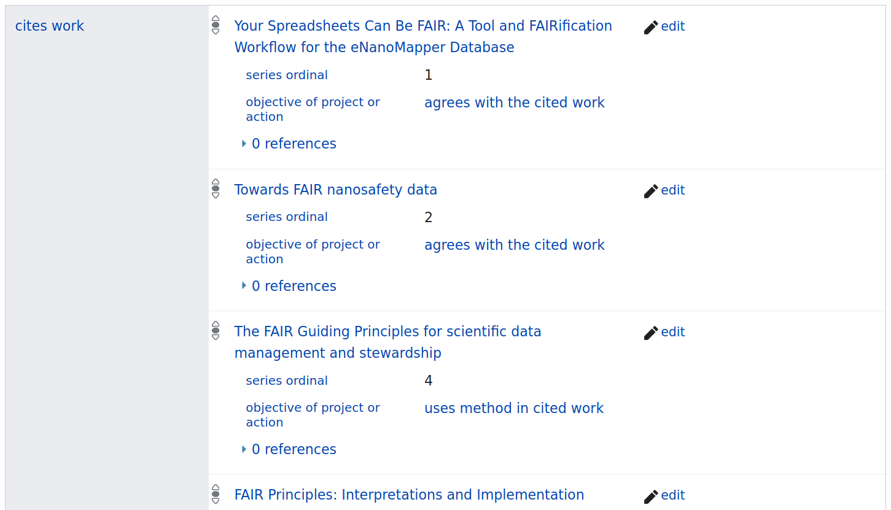
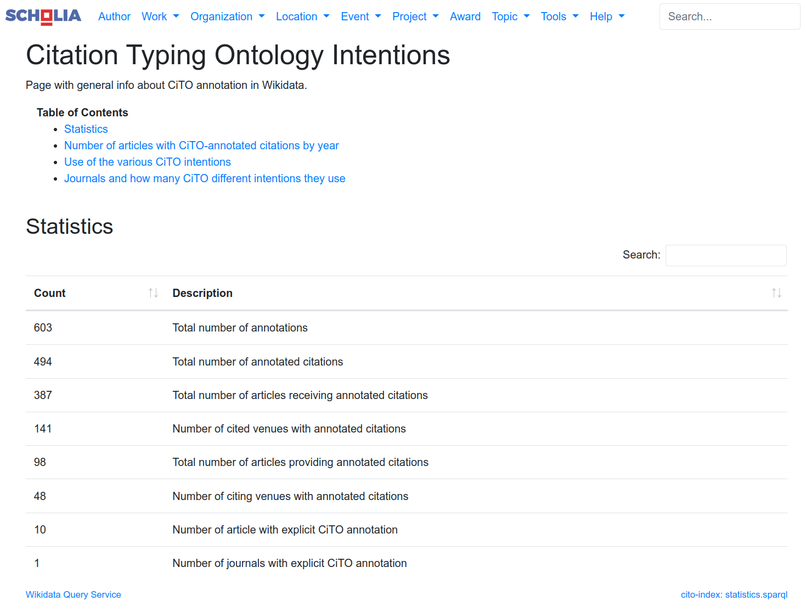

---
title: "Two years of CiTO annotations"
author:
- Egon Willighagen [1,*,orcid:0000-0001-7542-0286]
link-citations: yes
output:
  html_document:
    pandoc_args:
    - --lua-filter=filters/extract-cito.lua
    - --citeproc
    - --lua-filter=filters/insert-cito-in-ref.lua
  pdf_document:
    pandoc_args:
    - --lua-filter=filters/extract-cito.lua
    - --citeproc
    - --lua-filter=filters/insert-cito-in-ref.lua
  word_document:
    pandoc_args:
    - --lua-filter=filters/extract-cito.lua
    - --citeproc
    - --lua-filter=filters/insert-cito-in-ref.lua
# RStudio: cito-bibliography: bibliography.bib
# Other: bibliography: bibliography.bib
cito-bibliography: bibliography.bib
csl: journal-of-cheminformatics.csl
...

* Correspondance:
egon.willighagen@maastrichtuniversity.nl

# Abstract

Citations are an essential aspect of research communication and have become the basis of many
metrics in the academic publishing world. Some see citation counts as a mark of scientific impact or
even quality, but in reality the reasons for citing other work are manifold.
Two years ago the *Journal of Cheminformatics* proposed a pilot for the adoption of annotating
citations with their annotations. Basically, when you cite a source like a journal
article or datasets, you also explain why specifically you cite that article. Particularly,
the agreement and disagreement and reuse of methods and data is interesting.
This article explores what happened after the launch of the pilot, gives examples of
how people used the idea, and what needs to happen next.

# Main text

Communiting new research findings is primarily done by written texts in the form of scholarly
articles, books, and book chapters. To not having to repeat past research by themselves or others,
authors cite research relevant [@agreesWith:citesAsAuthority:Shotton_2010]. However, the reasons why
authors cite literature vary, which complicates how we use citations [@agreesWith:citesAsAuthority:Nicholson_2021]. 
Typing citations is therefore of interest: it allows us to navigate ltierature more easily: it points
us to essential research methods, data, and can warn us of research that cannot be reproduced,
or others disagree with [@Nicholson_2021].

With the use of citations increasingly being picked up to help researchers with tools like
scite.ai [@citesAsAuthority:Nicholson_2021] en Connected Papers, having typed
citations will help us explore literature. Therefore, the *Journal of Cheminformatics*
started a pilot for the adoption of annotating citations with their annotations [@discusses:Willighagen_2020].

# The Citation Typing Ontology Pilot

The pilot consists of a couple of components and the editorial explains some of them [@Willighagen_2020].
The Citation Typing Ontology was selected to express the intention [@usesMethodIn:Shotton_2010],
the intention is expressed a compact identifier wrapped in square brackets [@usesMethodIn:Wimalaratne_2018], and 
the *bibnotes* concept of the Springer Nature publishing platform was used as carrier.
Authors are guided by a landing page consisting of a BioMedCentral Collection at
[https://www.biomedcentral.com/collections/cito](https://www.biomedcentral.com/collections/cito)
and author guidelines explaining to authors
how they can add the annotations with their favoriate editor at
[https://jcheminform.github.io/jcheminform-author-guidelines/cito](https://jcheminform.github.io/jcheminform-author-guidelines/cito).

Because the CiTO ontology has many terms for many different citation intentions,
we made a selection of CiTO terms authors could use [@CiTOCollection]:
**[cito:citesAsDatasource]** to indicate
to a source the provides data to back up a claim, **[cito:usesDataFrom]** to indicate that the authors
reused data, **[cito:usesMethodIn]** when a method or protocol explain in that source is used,
and a few more general intentions like **[cito:discusses]**, **[cito:extends]**, **[cito:agreesWith]**,
and **[cito:disagreesWith]**.
The journal itself would adopt the following CiTO annotations: **[cito:retracts]**,
**[cito:repliesTo]**, and **[updates]**. Fortunately, it has not been used yet, but
the first would be used if an article with be retracted from the journal. The second
would be used when an Letter to the Editor replies to an earlier published article,
and **[cito:updates]** when an Correction was published. 

## Wikidata and Scholia

To track the uptake but also to demonstrate the impact, we extended Scholia to visualize
citation intention data. Scholia is a graphical interface around the data stored in
Wikidata [@usesMethodIn:Nielsen_2017] and includes citations from OpenCitations [@Peroni_2020]
and PubMed. Wikidata allows adding qualifier to statements which allowed us to define
a data model for citations annoted with CiTO intention; the Wikidata property P3712
has been used for this, labeled *objective of project or action* (see Figure 1).

**Figure 1**: Screenshot of the citation statements for an article where the
*objective of project or action* qualifier is used to annotate the citation with their
CiTO intentions.

This data in Wikidata can then be accessed via Scholia and Scholia tells use some
overall statisticss of the number of annotations, which we reported on about a year
ago too [@citesAsDataSource:Willighagen_2021]. Since last year and written down
on August 25, the number of annotations and the number of annotated citations
have almost doubled (from 377 to 603 and from 304 to 494, respectively). The first
number is higher because one citation can have more than one citation intention.
To continue, the current number of citations are citing 387 articles in 141 different
scholarly journals, and they are found in 98 articles in 48 different journals
(see Figure 2) [@citesAsDataSource:scholiaCiTOStatistics].

**Figure 2**: XXXX.

It must be noted that the *Journal of Cheminformatics* is only one possible source,
but is still the only journal that uses CiTO annotation explicitly in the articles itself.
And with 335 annotated citations in 32 articles it also is the major source of
CiTO annotations in Wikidata at the time of writing.
However, CiTO intention annotations in Wikidata can come from other sources too
and be added both manually and automatically using the tools around Wikidata.
When all annotation is combined, Scholia shows us that **[cito:citesAsAuthority]**
is the most used intention, with 226 annotated citations (out of 603) in 38 articles.
**[cito:usesMethodIn]** follows with 102 annotated citations.

## Adoption by *Journal of Cheminformatics* authors

XXXXX

## Technological innovation

Markdown template...

To make life easier for authors, and following a Twitter discussion in Spring 2021, we developed a Markdown template with native CiTO support. Here, the author merely indicates the CiTO type when they cite the article.

The manuscript can then easily be saved as a Word file to enable submission to the journal. The *Journal of Cheminformatics* template is available from our GitHub repository, and authors and editors should feel free to adapt it to their own journal needs.

## What is next?

With X articles published in the CiTO Collection, the adoption is not as high as one would have hoped.
Nevertheless, the pilot is triggering interest with both authors and publishing platforms. The Scholia
use case shows how the information can be used downstream. Further uptake of this idea of typed citations
depends on the combined willingness of journal editors, authors, publishers and indexing services alike.
The rise of services like scite.ai shows that the research community needs this kind of information.

#### Availability of data and materials
Text for this section.

#### Competing interests
Text for this section.

#### Funding
Text for this section.

#### Authors' contributions
Text for this section.

#### Acknowledgements

This work would not be possible without the support from Springer Nature and
Matthew Smyllie in particular and the editors of the *Journal of Cheminformatics*,
Rajarshi Guha, Nina Jealizakova, and Barbara Zdrazil. XXX is thanked for
integration the sections on CiTO use into the main Scholia journal aspects [REF].
Huge thanks goes to YYY for developing the Markdown/Pandoc integration.

# References
